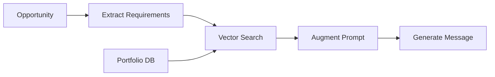
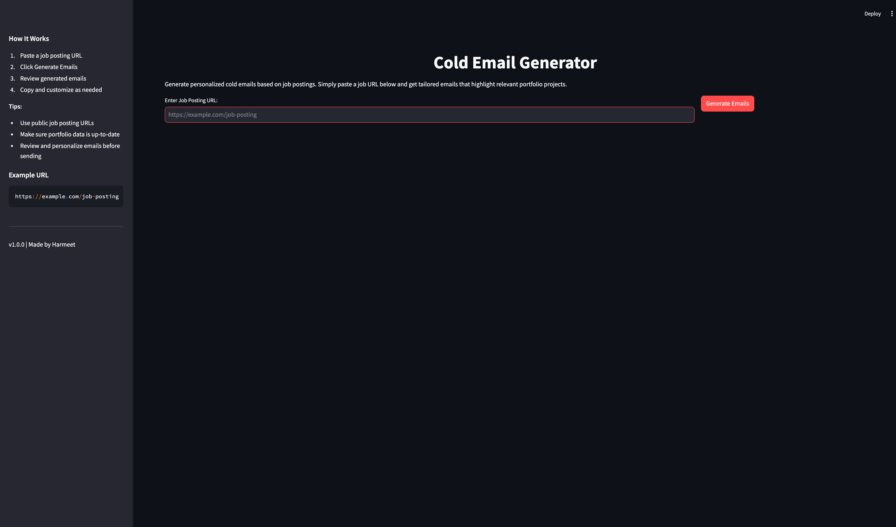
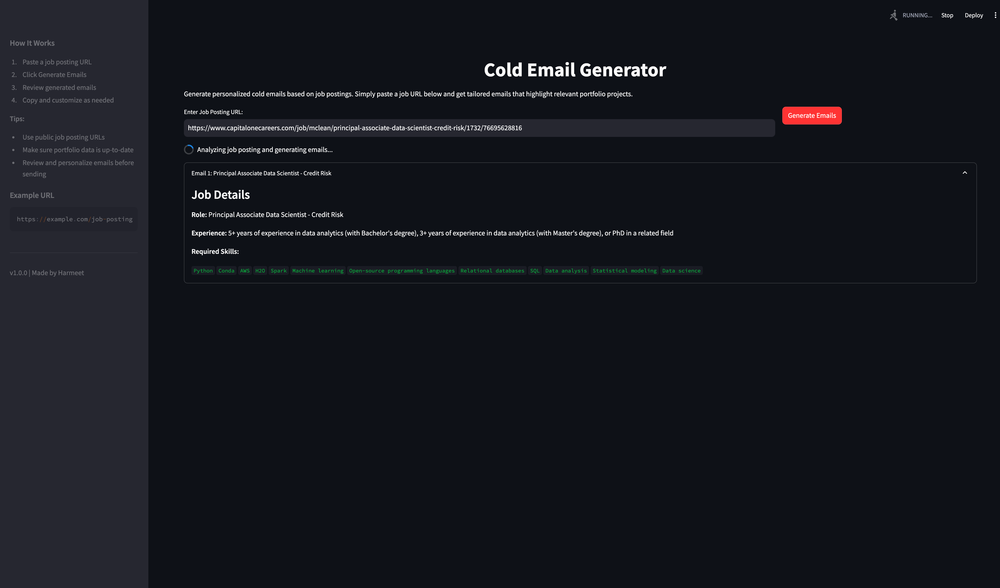
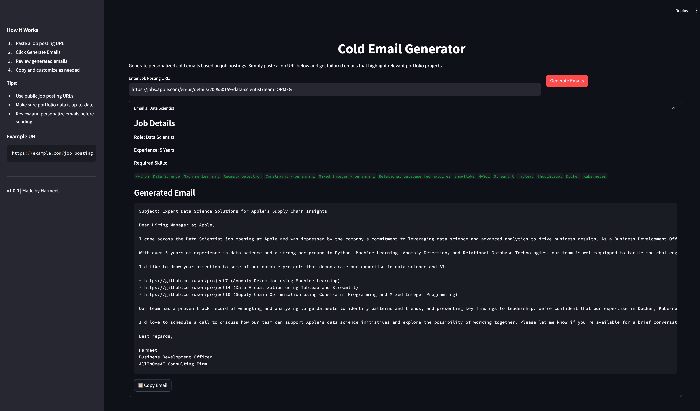

# 🎯 ProspectAI

<div align="center">


An AI-powered business development tool leveraging RAG (Retrieval Augmented Generation) to create personalized outreach messages by analyzing opportunities and intelligently matching them with relevant portfolio projects.

[🚀 Features](#-features) • 
[🛠️ Installation](#️-installation) • 
[💻 Usage](#-usage) • 
[🏗️ Architecture](#️-architecture) • 
[📸 Application Overview](#-application-overview)

</div>

## 🚀 Features

- **RAG-Based Outreach Generation**: 
  - Retrieves relevant portfolio projects using semantic search
  - Augments LLM prompts with matched projects
  - Generates contextually accurate and personalized messages
- **Automated Opportunity Analysis**: Extracts key information from job postings
- **Vector-Based Portfolio Matching**: Uses ChromaDB for efficient semantic search
- **User-Friendly Interface**: Clean and intuitive Streamlit web interface
- **Customizable Templates**: Adaptable message generation patterns

## 🧠 How It Works

### RAG Architecture
1. **Retrieval**:
   - Business requirements are extracted from opportunities
   - Portfolio projects are stored as embeddings in ChromaDB
   - Semantic search finds relevant projects based on requirements

2. **Augmentation**:
   - Matched portfolio projects enrich the prompt
   - Business context is structured for optimal LLM understanding
   - Skills and experience are aligned with portfolio examples

3. **Generation**:
   - Enhanced prompt generates personalized outreach
   - Portfolio evidence supports claimed expertise
   - Context-aware responses match business requirements



## 🛠️ Installation

1. Clone the repository:
```bash
git clone https://github.com/yourusername/ProspectAI.git
cd ProspectAI
```

2. Install dependencies:
```bash
pip install -r requirements.txt
```

3. Configure environment variables:
```bash
# Create .env_local file and add your API keys
cp .env.example .env_local

# Add the following to .env_local:
GROQ_API_KEY=your_groq_api_key
LANGSMITH_API_KEY=your_langsmith_api_key
```

4. Prepare portfolio data:
```bash
# Update sample_portfolio.csv with your projects
# Format: skill1,skill2,skill3,project_url
```

## 💻 Usage

1. Start the application:
```bash
streamlit run main.py
```

2. Access the web interface at `http://localhost:8501`

3. Enter an opportunity URL and click "Generate Message"

4. Review and customize the generated outreach

## 🏗️ Architecture

## Project Structure

- `main.py`: Streamlit application entry point
- `chains.py`: Language model chains for text processing
- `portfolio.py`: Portfolio management and matching
- `utils.py`: Utility functions
- `sample_portfolio.csv`: Portfolio data storage

## Dependencies

- Streamlit
- LangChain
- ChromaDB
- Groq LLM

## 📸 Application Overview

<div align="center">
  <p><strong>ProspectAI in Action: From Job Posting to Personalized Outreach</strong></p>
  
  <p><em>Clean interface with clear instructions and example URL</em></p>
  
  
  <p><em>Real-time job requirement extraction and skill matching</em></p>
  
  
  <p><em>AI-generated personalized outreach with relevant portfolio links and copy functionality</em></p>
</div>

The application features a dark-themed, professional interface that guides users through the entire process - from inputting a job posting URL to receiving a tailored outreach message. The intuitive design includes:

- Clean, distraction-free input interface
- Real-time processing indicators
- Skill tag visualization
- Expandable job details section
- One-click email copying
- Helpful sidebar with tips and instructions
