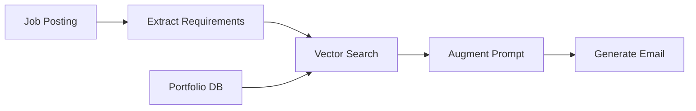

# 📧 Cold Email Generator

<div align="center">


An AI-powered tool leveraging RAG (Retrieval Augmented Generation) to create personalized cold emails by analyzing job postings and intelligently matching them with relevant portfolio projects.

[Features](#features) • [Installation](#installation) • [Usage](#usage) • [Architecture](#architecture)

</div>

## 🚀 Features

- **RAG-Based Email Generation**: 
  - Retrieves relevant portfolio projects using semantic search
  - Augments LLM prompts with matched projects
  - Generates contextually accurate and personalized emails
- **Automated Job Analysis**: Extracts key information from job postings using LLM
- **Vector-Based Portfolio Matching**: Uses ChromaDB for efficient semantic search
- **User-Friendly Interface**: Clean and intuitive Streamlit web interface
- **Customizable Templates**: Adaptable email generation patterns

## 🧠 How It Works

### RAG Architecture
1. **Retrieval**:
   - Job requirements are extracted from postings
   - Portfolio projects are stored as embeddings in ChromaDB
   - Semantic search finds relevant projects based on skills and context

2. **Augmentation**:
   - Matched portfolio projects enrich the prompt
   - Job context is structured for optimal LLM understanding
   - Skills and experience are aligned with portfolio examples

3. **Generation**:
   - Enhanced prompt generates personalized emails
   - Portfolio evidence supports claimed expertise
   - Context-aware responses match job requirements



## 🛠️ Installation

1. Clone the repository:
```bash
git clone https://github.com/yourusername/Cold_Emails_Generator.git
cd Cold_Emails_Generator
```

2. Install dependencies:
```bash
pip install -r requirements.txt
```

3. Configure environment variables:
```bash
# Create .env_ file and add your API keys
touch .env

# Add the following to .env:
GROQ_API_KEY=your_groq_api_key
LANGSMITH_API_KEY=your_langsmith_api_key
```

4. Prepare portfolio data:
```bash
# Update sample_portfolio.csv with your projects
# Format: skill1,skill2,skill3,project_url
```

## 💻 Usage

1. Start the application:
```bash
streamlit run main.py
```

2. Access the web interface at `http://localhost:8501`

3. Enter a job posting URL and click "Generate Emails"

4. Review and customize the generated emails

## 🏗️ Architecture

## Project Structure

- `main.py`: Streamlit application entry point
- `chains.py`: Language model chains for text processing
- `portfolio.py`: Portfolio management and matching
- `utils.py`: Utility functions
- `sample_portfolio.csv`: Portfolio data storage

## Dependencies

- Streamlit
- LangChain
- ChromaDB
- Groq LLM
